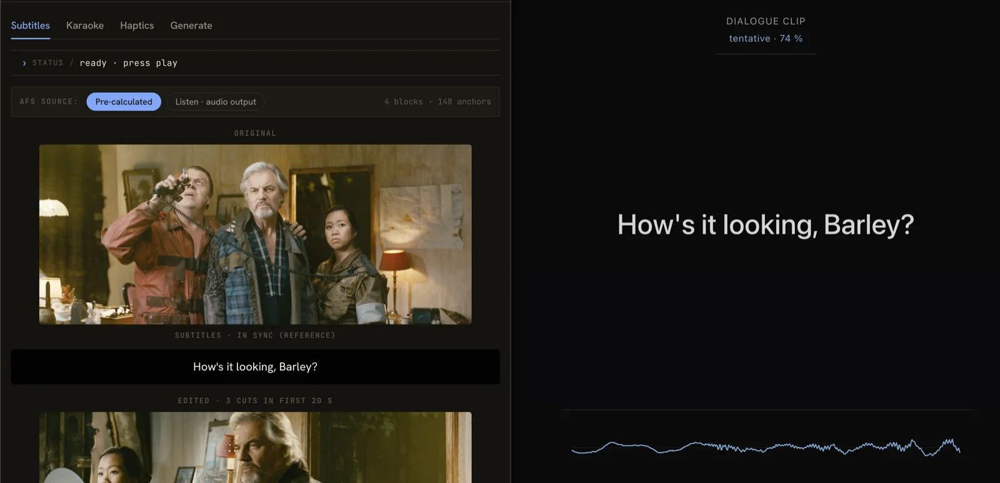
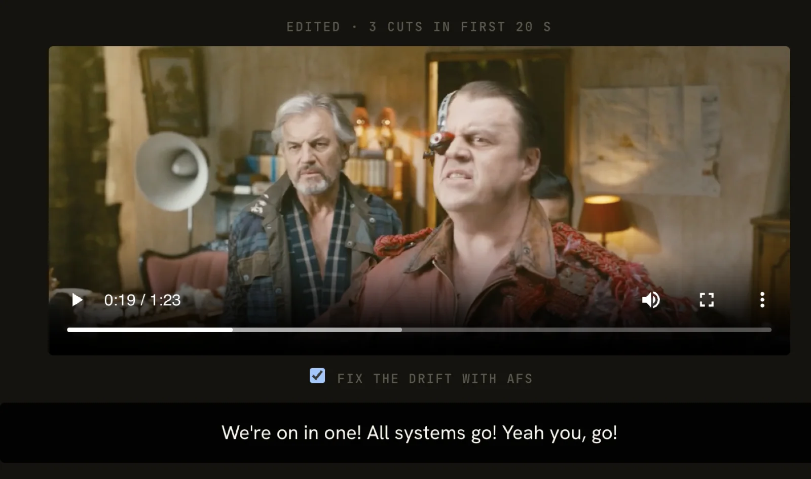

# AFS Tools

Reference implementation and demo for
[AFS — Audio Fingerprint Sync](https://github.com/dariodf/afs).

**What AFS does.** AFS fingerprints any audio into a small stream of
time cues. Any device hearing that audio — through its own speakers,
or through a microphone listening to another device — matches the
fingerprints to its current position and stays in sync with the
source in real time. No network connection between the devices, no
clock sync, no companion app: just audio.

**What you can use it for.** All variations of the same primitive
("tell me where in the source I am right now"):

- **Subtitles that don't drift** — ship an AFS made from the
  original source alongside your existing SRT. Any player with
  both files renders the correct subtitle for the moment the
  audio is at, regardless of cuts, ad breaks, or re-encodes
  applied downstream.
- **Cross-device subtitles** — smart glasses or a phone listen to a
  TV or laptop via microphone and show the subtitles themselves. No
  companion app, no network between devices.
- **Karaoke lyrics on a second screen** — same flow as subtitles,
  but with song lyrics; works for any device playing the song.
- **Haptics, lights, any synced-to-audio reaction** — a device
  with the AFS for a track can fire events at exact audio moments
  by listening to whatever's playing.

**Try it live: <https://dariodf.github.io/afs-tools/>**

**What's in this repo.** Three demos that show what that enables:

- **Subtitles** — a 90-second movie clip whose subtitles stay
  correct even after three short cuts shift the timeline.
- **Karaoke** — a 1:55 Silent Night recording; open the listen page
  on your phone and the lyrics appear in sync with whatever device
  is playing the song.
- **Haptics** — the 1812 Overture finale; your phone vibrates and
  flashes a cannon on every cannon hit.

Plus a browser-side **Generate** tool for making your own AFS files
from media you have locally, a standalone **listen.html** page any
device can use as a microphone-driven sync player, and a small Bash
CLI in `tools/`.





## Quick start

### Generate an AFS file

```bash
./tools/afs-generate/afs-generate movie.mp4
# Produces movie.afs
```

See [`tools/afs-generate/`](./tools/afs-generate/) for install
requirements (`ffmpeg` + `fpcalc`).

### Run the demo locally

The demo is a static site. From the repo root:

```bash
npm install
# Copy npm-installed deps where the import map expects them
mkdir -p demo/vendor/smol-toml demo/vendor/qrcode-generator
cp node_modules/smol-toml/dist/*.js demo/vendor/smol-toml/
cp node_modules/qrcode-generator/dist/qrcode.mjs demo/vendor/qrcode-generator/index.mjs

cd demo && python3 -m http.server 8000
```

Then open <http://localhost:8000> in a browser. For microphone access
on most browsers, `localhost` is treated as a secure context; deployed
versions require HTTPS.

## How to use it for subtitle sync

To ship subtitles that don't go out of sync you produce a paired
set of two files and distribute them together:

1. **An AFS file**, generated from the *original source* media —
   the master cut; the same version your subtitles are timed
   against. The AFS captures what the source sounds like at every
   moment.
2. **An SRT (or VTT) file** whose timings line up with that same
   source. AFS doesn't rewrite subtitle timings; it makes sure the
   player knows where it is in the source. The SRT still has to be
   correct against that source.

**Neither file does the job alone.** AFS without an SRT has nothing
to display. An SRT without an AFS drifts exactly the way it has
always drifted.

**You only need to be correct once.** Get the SRT synced against the
source one time. From then on, ship the SRT alongside the AFS and
the pair works every single time — broadcast cuts with ad breaks
inserted, third-party rips, copies trimmed by 30 s, transcodes
with different framing. The AFS lets the player find its true
source position from the audio, so no downstream cut or re-encode
can break the binding.

### Producing the pair

If you already have a synced SRT for your source, generate the AFS
from the same source media:

```bash
./tools/afs-generate/afs-generate movie.mp4   # → movie.afs
# Pair this movie.afs with your existing movie.srt.
```

In a browser, [generate.html](https://dariodf.github.io/afs-tools/generate.html)
does the same thing — drop the source media, download the AFS,
bring your own SRT.

If you have only the source media and no subtitle file, this tool
produces both in one step (via WhisperX transcription):

```bash
./tools/transcribe-generate/transcribe-generate movie.mp4
# → movie.afs + movie.en.srt, both timed to the same source.
```

If you have the *text* but no timings (an official screenplay, the
canonical lyrics for a song, a subtitle file that's drifted), align
the transcript instead of transcribing — skips Whisper's ASR stage
so the model never guesses words, just finds when each known word
occurs:

```bash
./tools/transcribe-generate/transcribe-generate --transcript script.txt movie.mp4
# → movie.afs + movie.srt, with your text and aligned timings.
```

### Playing back the pair

The device that displays the subtitle needs **both** files. Two flows:

- **Same-device** — a video player loads the AFS and the SRT,
  fingerprints its own audio output, and renders the subtitle at
  the matched source position. The reference subtitle demo shows
  this end-to-end.
- **Cross-device** — open `listen.html` on the device that should
  show subtitles (typically a phone), point it at the AFS + SRT
  (via URL parameters or local-file pickers), and let it listen via
  microphone. The audio source can be a separate laptop, a TV, or
  any device playing the original source — including any re-cut,
  ad-broken, or re-encoded version of it.

The subtitle-displaying device doesn't need a copy of the source
media itself — only the AFS + SRT pair. The source plays from
wherever it normally plays.

## Use the listen page with your own files

`demo/listen.html` is a self-contained AFS player: open it in a
browser, point it at an AFS + SRT pair, and a second device's
microphone follows along with whatever audio it hears. The page is
usable without any of the bundled demos, so you can host your own
AFS file somewhere and share a one-link experience.

Two ways to point it at files:

**1. URL parameters** (best for shareable links):

```
https://<your-deploy>/listen.html
  ?afs=https://example.com/my-movie.afs
  &srt=https://example.com/my-movie.en.srt
  &title=My%20Movie
```

All three params (`afs`, `srt`, `title`) are independent — supply
any subset; the page will show file pickers for the missing ones.

**2. Local files** (best for "I generated an AFS, transferred it
to my phone"): open `listen.html` with no parameters and use the
file pickers to load `.afs` and `.srt` from local storage. Nothing
uploads.

**CORS caveat.** When using URL parameters that point to a
different origin than the page is hosted on, your file server must
return `Access-Control-Allow-Origin` headers permitting the page's
origin. GitHub Pages, Netlify, Vercel, and most public S3 buckets
do this by default. Private servers or strict CDN setups may block
the fetch with a CORS error — that's on the file host to configure,
not on the player.

## How AFS works

A reader who wants to re-implement an AFS listener in any
environment — another language, another runtime, embedded in a
larger system — needs to understand the algorithm. The normative
format lives in the [spec](https://github.com/dariodf/afs); this
section is the 30-second-read summary.

**The file.** An AFS file is a TOML header naming the
fingerprinting algorithm, then a body where each line is a time
cue (in milliseconds) and a fingerprint payload separated by
whitespace:

```
[afs]
version = "0.1"

[fingerprint]
algorithm = "chromaprint"

[metadata.source]
title = "My Movie"
duration_ms = 5396604

---
0 568779850
124 1642427401
248 1634032664
...
```

For `algorithm = "chromaprint"`, each payload is a single 32-bit
integer hash. Hashes appear every ~124 ms (chromaprint's hop at
its canonical 11025 Hz / 4096-sample window / 2/3 overlap).

**The match.** A listener's job is to determine where the listener
is right now in the source audio that the AFS file describes. The
flow:

1. **Capture audio** from a microphone or the player's audio
   output. Downmix to mono.
2. **Fingerprint** the captured audio with the same algorithm
   declared in the AFS header (chromaprint in v0.1), feeding it
   at its native sample rate so the algorithm resamples
   internally with its own resampler. You get a stream of 32-bit
   hashes, same shape as the AFS body.
3. **Search** the AFS body for the position whose stored hashes
   best match the captured hashes. The comparison metric is
   summed Hamming distance — for each pair of (captured,
   stored) hashes in a window, count the bits that differ; sum
   over the window. The position with the lowest summed Hamming
   distance is the best match.
4. **Report** the matched position (in milliseconds from source
   start). Once a confident match exists, subsequent ticks only
   need to search locally — the new position is almost certainly
   within a few hops of the previous one.

**Why this works.** Chromaprint is designed for noise tolerance.
Bit-level Hamming distance over many hashes washes out
moderate noise; you can capture through speakers and a phone mic
and still recognize the source. AFS adds nothing to that
algorithm — it just packages the hashes with explicit time cues
and metadata so a player can localize without contacting a
remote database.

**What AFS doesn't do.** v0.1 expects the captured audio to be
the *same recording* the AFS file describes (modulo
re-encoding, noise, and mic capture). It cannot follow a
*different performance* of the same piece — different orchestras,
different singers, different tempos produce different
chromaprint hashes even when sounding "the same." Cross-
performance matching is a different family of algorithm; see
[Explorations](#explorations).

## How the listener works

The reference listener (`demo/src/listen.js` + supporting modules)
is ~400 lines of plain JS. The non-obvious parts:

**Audio capture** (`src/audio-capture.js`) is either microphone
(`getUserMedia` → `MediaStreamSource`) or a media element
(`MediaElementSource`). An AudioWorklet drains PCM samples into a
ring buffer. The matcher tick reads the latest ~2.6 s of samples,
hands them to the WASM chromaprint fingerprinter, and gets back
a small array of new hashes.

**Matcher state machine** (`src/listen.js`) tracks position in
three states:

- **LOST** — no anchor. Any confident match (confidence above
  `enterThreshold`, default 75 %) anchors us and promotes to
  TRACKING.
- **TRACKING** — have an anchor. Each new accepted match
  refreshes the anchor. Between matches, the displayed position
  is projected forward at 1× wall-clock (`lastMatchSourceMs +
  elapsed`). A new match within `CONTINUITY_TOLERANCE_MS` of the
  projection is accepted normally; one outside that window is
  treated as a possible JUMP and requires a corroborating
  second match before moving the anchor (filters out random
  wrong-cut matches).
- **Silence gate / LOST timeout** — if the captured audio's peak
  amplitude stays below `SILENCE_PEAK_THRESHOLD` for
  `SILENCE_TICKS_BEFORE_LOST` (~2 s), we drop back to LOST. Same
  if we go `LOST_TIMEOUT_MS` (default 6 s) without any accepted
  match.

**Forward projection** (`PROJECT_MAX_MS`, default 1000) caps how
far ahead of the last confident match the displayed position
will advance. Within that window the position projects forward
at 1× wall-clock between matcher ticks; past it, the position
freezes. This handles chromaprint confidence dropouts (where
the matcher can't lock for a few seconds but the source is still
playing) without showing wrong cues when the source genuinely
paused.

**Lock-on time** for a clean source is ~3.5 s — chromaprint
needs at least 8 hashes to commit to a position, and 8 hashes
require ~1 s of audio plus the algorithm's 2.6 s analysis-window
warm-up.

**The building blocks**, end to end:

1. **AFS file reader** — parses the TOML header + body (numeric
   `time_ms hash` pairs). The format is simple enough to write
   from the spec in any language; no library needed.
2. **Audio source** — a stream of PCM samples. Origin is up to
   the embedding context: a microphone, the audio output of a
   media file the same process is playing, a system loopback,
   an audio pipe from another process, etc. AFS doesn't care
   where the samples come from, only that they're real-time.
3. **Fingerprinter** — the algorithm declared in the AFS header
   (chromaprint for v0.1). Libchromaprint has stable bindings
   for C / Python / Rust / Go / Java and a WASM build for the
   browser. Feed it the captured PCM at the source's native
   sample rate; receive back a stream of 32-bit hashes.
4. **Matcher** — compares captured hashes against the AFS body's
   stored hashes. The reference implementation in
   `demo/src/afs-matcher.js` is ~300 lines of plain JS, algorithm-
   agnostic in shape (`hashes` + `times` arrays in, current
   position + confidence out), and portable to any language. The
   inner loop is integer bitcount + min-sum over a window.
5. **State machine + state-aware position output** — described
   above. Independent of language and of consumer; whatever
   shows synced data to the user (subtitle renderer, lighting
   controller, haptic motor, etc.) just receives the position
   estimate and acts on it.

Each block can be swapped without touching the others. A
re-implementation in a different language reuses the same five-
block structure with that language's chromaprint binding and the
same matcher state machine. The reference matcher is short
enough to port directly; the rest is glue.

## Status

v0.1 release candidate. The AFS parser, matcher, SRT parser,
writer, and haptics event scheduler are implemented and tested.
The browser demo runs three live demos (subtitles desync, karaoke,
haptics), all driven by real-time chromaprint fingerprinting in
WebAssembly (via `@unimusic/chromaprint`). A companion
`listen.html` page works on a second device's microphone for
cross-device sync, and a `generate.html` page produces AFS files
in the browser for your own content.

AFS files are plain text and gzip-friendly — a 2-hour movie's AFS
is ~1 MB raw, ~400 KB over `Content-Encoding: gzip` (which every
modern CDN applies automatically).

A potential v0.2 migration to Shazam-style landmark fingerprinting
is documented in `ROADMAP.md` but deferred. v0.1 ships with
chromaprint because of its existing ecosystem (libchromaprint,
fpcalc, language bindings) — anyone re-implementing an AFS
listener already has a chromaprint binding available in most
mainstream languages.

## Explorations

Two alternative fingerprinting / matching approaches were spiked
on parallel branches. Neither shipped in v0.1; both are preserved
with their measurements and code in case the work resumes.

- [`shazam-landmark`](https://github.com/dariodf/afs-tools/tree/shazam-landmark/experiments/landmark)
  — Wang-2003 landmark fingerprinting (the Shazam algorithm), as
  a candidate v0.2 algorithm. Same use case as chromaprint
  (same-source matching) with different noise / latency trade-offs.
  See [FINDINGS.md](https://github.com/dariodf/afs-tools/blob/shazam-landmark/experiments/landmark/FINDINGS.md).
- [`chroma-dtw`](https://github.com/dariodf/afs-tools/tree/chroma-dtw/experiments/chroma-dtw)
  — chroma vectors + dynamic time warping for *cross-performance*
  alignment. A different problem from AFS v0.1 (different
  performances of the same piece, not the same recording across
  devices). Empirically works at ~30 s lock-on; would need score-
  informed alignment or HMM state tracking to be production-grade.
  Could become AFS v0.3 or a parallel project.
  See [FINDINGS.md](https://github.com/dariodf/afs-tools/blob/chroma-dtw/experiments/chroma-dtw/FINDINGS.md).

## Tools

The CLI lives under [`tools/`](./tools/). Each tool has its own
folder with focused docs:

- [`tools/afs-generate/`](./tools/afs-generate/) — media file → AFS.
  The everyday tool.
- [`tools/afs-format/`](./tools/afs-format/) — lower-level:
  `fpcalc -raw` output → AFS. Used by `afs-generate` internally;
  handy on its own when you already have an fpcalc stream.
- [`tools/transcribe-generate/`](./tools/transcribe-generate/) —
  media → time-aligned SRT (via WhisperX) **and** AFS, in one step.
  Pass `--transcript path.txt` to skip Whisper ASR and align an
  authoritative transcript you already have (screenplay, official
  lyrics, drifted SRT) — produces a correctly-timed SRT without
  guessing words.
- [`tools/afs-minimize/`](./tools/afs-minimize/) — drop AFS hashes
  outside subtitle coverage windows. Useful for sparse-cue content
  and for distributing AFS files outside HTTP.

## Contributing

See [CONTRIBUTING.md](./CONTRIBUTING.md) for how to run tests,
add content, and submit changes.

## License

Apache License 2.0.
